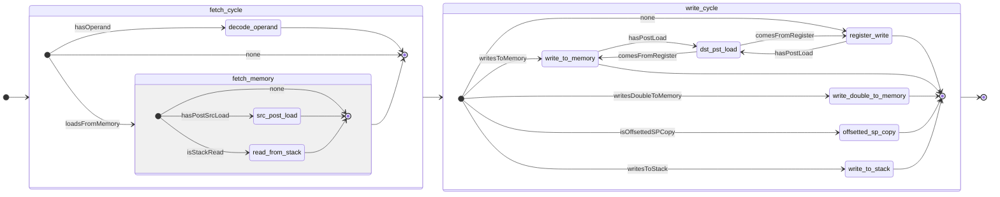
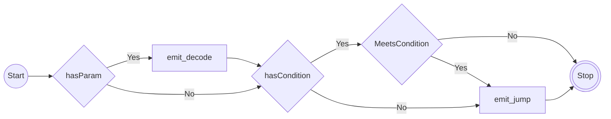

# Standards for Emitted IR

Parser emits Write/Halt commands from concrete
instructions, this is the `beemu`'s format of
a bytecode or intermediate representation,
although read operations are done at parsing
time to avoid the need for a stack machine
and some other mechanisms that would add 
development complexity.

It could be that this is a horrible idea though.

Different instruction types emit different types
of byte codes, in general, the emitted byte-codes
will fit one-to-one with the established reverse
engineered Gameboy instruction detailed machine
cycles breakdowns, these can be seen in Gekkiko's
[Gameboy technical reference](https://gekkio.fi/files/gb-docs/gbctr.pdf).
However, the aim of the beemu isn't one-to-one
hardware emulation, so side-effects unobservable
by the "outside" (emulation frontend) may not
be emulated correctly.

## Notes about edge cases

### Handling Pipelining

As notes by the previously referred technical
document, some pipelining exists in Gameboy's
SHARP SM83 has some pipelining, although
calling it pipelining does make it a bit of an
overservice (whatever the antonym of disservice is),
however, in general the previous instruction's MLast
(last machine cycle) is used to fetch the next instruction

To handle this, `CommandQueue`'s do not
end with a `HALT` order, this is *not* an
oversight, nor is it an optimization (as you could)
just assume an `HALT` at the end of a `CommandQueue`,
but a signal that the next instruction can be
fetched immediately without halting.

### Handling (HL)

When dereferencing `HL` (or frankly, any register),
the data bus and the address bus is temporarily
populated by the `HL` register's contents, this
is then reverted at the MLast.

### Handling Special cases with JR and JP

Certain `JP` and `JR` calls set the `PC` in their
`MLast/M1` which means they fetch the next instruction,
when this occurs, the `Invoker` *DOES NOT* execute
the `M1` cycle `PC/IR` fetches for the instruction
immediately following them.

### Data and Address Buses

Emulatino of the two busses connected to the
ALU and IDU are mostly for emulation for emulation
sake, and they are not used by the internal
`beemu` implementation, therefore
busses are not emulated

## Specific Emit Flows

Here are some notes about the emit flows and the way they were written

### Arithmatic

This was written without much planning, it shows.

### Load

Having taken a valuable lesson from arithmatic instructions, I sat
down and planned this, and while it did simplify things I made the
mistake of writing a custom state machine infrastructure for this reason.

Look, I think I was drunk when I came up with this idea but I wrote
the load parser as a state machine, this wasn't a good idea as much
as I thought it was and it actually ended up more complicated than I
thought, who could have guessed?

Anyway here is how it works though:

### Jump

